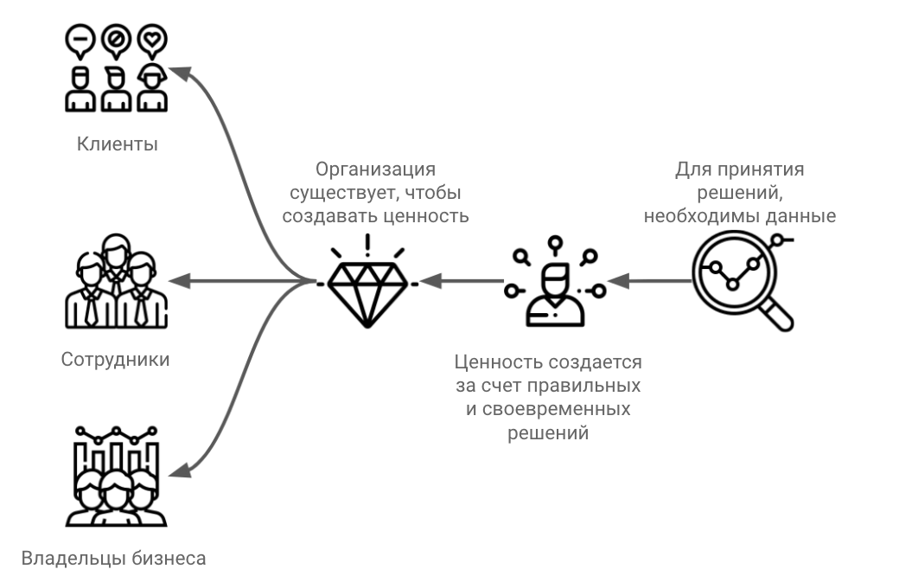
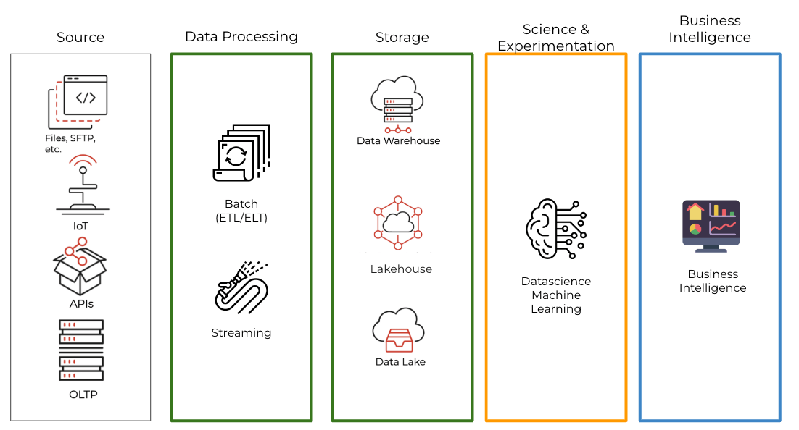

⚠️ Сайт в разработке ⚠️

Не пропустите анонс, подпишитесь на телеграмм канал - [Инжиниринг Данных](https://t.me/rockyourdata).

## Цель сайта

**Дата Инженеръ** — это русскоязычный портал об аналитике и инжиниринге данных. Здесь мы постараемся собрать самые ценные ресурсы, связанные с развитием карьеры в области инжиниринга данных. Материалы будут доступны на русском и английском языках.

## Для кого этот сайт?

Если вы работаете с данными как **аналитик**, **BI-разработчик**, **инженер данных** или вам просто интересно, кто такой инженер данных и как им стать, то здесь вы можете найти все необходимые ресурсы.

## Что такое Аналитика?

Прежде чем начать изучать инжиниринг данных, давайте определимся, что такое аналитика и какие у неё цели.

Согласно книги [Hyper: Changing the way you think about, plan, and execute business intelligence for real results, real fast!](https://www.porchlightbooks.com/product/hyper-changing-the-way-you-think-about-plan-and-execute-business-intelligence-for-real-results-re--gregory-p-steffine/isbn/9780692423080), организации существуют, чтобы создавать ценность (value) для клиентов, сотрудников или владельцев. Чем больше ценности создано, тем эффективнее работают организации.

Чтобы создавать больше ценности, необходимо принимать правильные и своевременные решения. Для этого нужны данные и аналитика.

Таким образом, мы занимаемся аналитикой и инжинирингом данных, чтобы помогать организациям создавать ценность для клиентов, сотрудников, учредителей и руководителей.

Цели аналитики можно сформулировать так:

	1.	Увеличение прибыли — заработать больше денег.
	2.	Сокращение расходов — сэкономить больше денег.
	3.	Избежание рисков, что, в свою очередь, помогает выполнить пункты 1 и 2.
	4.	Исследование новых рынков и продуктов через проверку и валидацию гипотез.

## Архитектура Аналитического Решения

Очень часто на собеседовании на роль дата-инженера вас могут попросить решить задачу по системному дизайну (System Design). Это очень важная часть работы инженера. Как и с постройкой домов, прежде чем начать строить дом, нам нужен план, чертежи, правильные инструменты и команда. Так же и в аналитике: прежде чем писать код, нужно определиться с архитектурой решения. К счастью для нас, мы можем использовать универсальную диаграмму, которая будет состоять из нескольких слоев:

Слои аналитического решения:
- **Источники данных (Source)**  
  Как правило, это бизнес-приложения (CRM, ERP и т. п.), различные API, бэк (backend) базы данных (OLTP), которые могут быть реляционными или NoSQL, логи, файлы, телеметрия и множество других источников. Ключевое слово здесь — это бизнес-процессы, системы и приложения, которые создают данные и важны для измерения эффективности бизнеса и принятия решений.

- **Системы обработки и интеграции данных (Processing)**  
  Набор инструментов и подходов для интеграции с системами-источниками, обработки и загрузки данных в хранилище данных. Существует два основных подхода: `Batch` (пакетный) и `Streaming` (потоковый). Как правило, выбор зависит от целей и задач аналитики. В 80% случаев используется `Batch`, так как он проще и удобнее в поддержке и внедрении. `Batch` можно разделить на два подхода — `ETL` и `ELT`.

- **Платформы хранения данных (Storage)**  
  Сейчас существует несколько вариантов: Хранилище Данных (Data Warehouse) и Озеро Данных (Data Lake).

- **Системы для углубленной аналитики (AI, ML, Data Science)**  
  Очень часто компании используют `Python` и готовые библиотеки или вендорские решения. Здесь мы не будем углубляться в этот вопрос.

- **Системы для работы с данными через удобные интерфейсы, системы отчетности и ad-hoc запросов (Business Intelligence)**  
  Эти системы предоставляют пользователям доступ к данным для принятия решений.

## Ключевые Роли в Аналитике

Согласно диаграмме аналитического решения, у нас есть пять основных слоев. Теперь мы можем сгруппировать их по функциональным ролям:

- **Дата-инженер**  
  Отвечает за системы `Processing` и `Storage`. Иногда инженер должен строить дашборды в инструментах `Business Intelligence` или помогать с ML-задачами. Аналоги роли: ETL-разработчик, разработчик хранилища данных, Big Data-разработчик. То есть дата-инженер строит инфраструктуру для аналитического решения и взаимодействует с бизнесом и разработчиками продуктов, чтобы учесть все нюансы при разработке решения.

- **BI-разработчик**  
  Отвечает за системы `Business Intelligence`, разрабатывает дашборды, общается с бизнес-заказчиками и помогает правильно интерпретировать данные. Иногда в обязанности входит предоставление бизнес-рекомендаций на основе анализа данных (business insights).

- **Аналитик данных**  
  Аналитики бывают разными — продуктовые, финансовые, маркетинговые. Эта роль пересекается с BI-разработчиком, но требует более глубокого подхода в анализе данных и выработке бизнес-рекомендаций. Роль аналитика достаточно сложна, так как не существует четкого определения, и каждая компания трактует её по-своему — от разработчика отчетов до дата-сайентиста (есть ли вообще такой термин на русском?). Задачи могут включать анализ и разработку бизнес-показателей, проведение A/B-тестов, создание дашбордов и отчетов, сбор требований, коммуникацию с бизнес-заказчиками и инженерами.

- **Analytics-инженер**  
  Эта роль практически не встречается на русском языке и представляет собой микс дата-инженера и BI-разработчика.

> Роли для работы с AI и ML здесь не рассматриваются, так как портал нацелен на решения для хранилищ и озер данных.

  
## Инжиниринг Данных

Мы разобрались с основными вещими, и теперь можно неспосредственно закрпепить определение Инжиниринга Данных. Сначала посмотрим на определине от лидеров индустрии:

> IBM: Data engineers work in a variety of settings to build systems that collect, manage, and convert raw data into usable information for data scientists and business analysts to interpret. Their ultimate goal is to make data accessible so that organizations can use it to evaluate and optimize their performance.

> Real Python: The ultimate goal of data engineering is to provide organized, consistent data flow to enable data-driven work

> CIO: Data engineers are responsible for finding trends in data sets and developing algorithms to help make raw data more useful to the enterprise. 

> Dremio: Data engineering helps make data more useful and accessible for consumers of data. To do so, ata engineering must source, transform and analyze data from each system. 

> Gartner: Data engineers play a key role in building and managing data pipelines, and promoting data and analytics use cases to production (in line with business processes). 

> Microsoft: Data Engineers help stakeholders understand the data through exploration, and they build and maintain secure and compliant data processing pipelines by using different tools and techniques. 

> Amazon: Data Engineers tackle some of the most complex challenges in large-scale computing. Most of the work they do involves storing and providing access to data in efficient ways.

А теперь просуммируем всю информацию выше и запише определение:

Инжиниринг Данных делает данные полезными и доступными для конечных потребителей, создавая безопасную и масштабируемую инфраструктуру.

## Учебные материалы

И теперь можно перейти к главной цели данного ресурса. На сайте мы планируем опубликовать ссылки на различные бесплатные курсы, тренинги, тренажёры, книги и многое другое, что поможет вам стать успешнее и достичь поставленных кареьерных целей в области Инжиниринга Данных

Категории будут следующие:
- Дорожная карты (Road Map) для профессий Инженера Данных, BI Разработчик и Аналитик.
- Технические навыки
  - Фундаментальные знания
  - Языки программирования
  - Программы для Интеграции Данных
  - Программы для Визуализации Данных
  - Системы хранения и обработки данных
  - AI решения
- Навыки эффективного взаимодействия (Soft Skills)
- Навыки собеседования
- Примеры архитектур аналитических решений
- Идеи проектов для самостоятельного обучения
- Сообщества и мероприятия для нетворкинга и обучения

## Как добавлять ресурсы?

Данные контент хостится в репозитории и контент можно добавлять черех Pull Request. В данный момент формируется список участников и модероторов, которые могу добавлять контент и редактировать существующий.

## Для компаний

Если вы хотите рассказать о своём продукте или решении, вы всегда можете связаться с нами, и мы это рассмотрим.

## Лицензия

Содержание предоставляется бесплатно. Если вы делитесь его частью, пожалуйста, указывайте источник.

Авторские права © 2024 Дмитрий Аношин.
